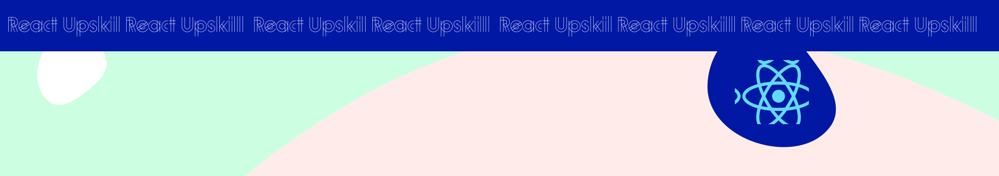

<h1 align="center">
  
</h1>
  

 This repository will be the hub where we gather all lessons, and class materials for our course, creating a one-stop destination filled with code exmaples and explanations for you to keep with you. 

 

 Built with ❤️ by  Diego Zito

 Quote of the class

 Only the educated are free  - Epictetus

